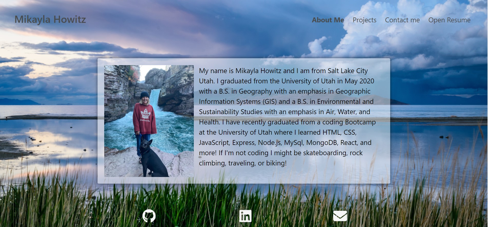
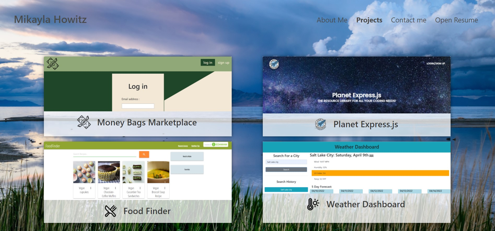
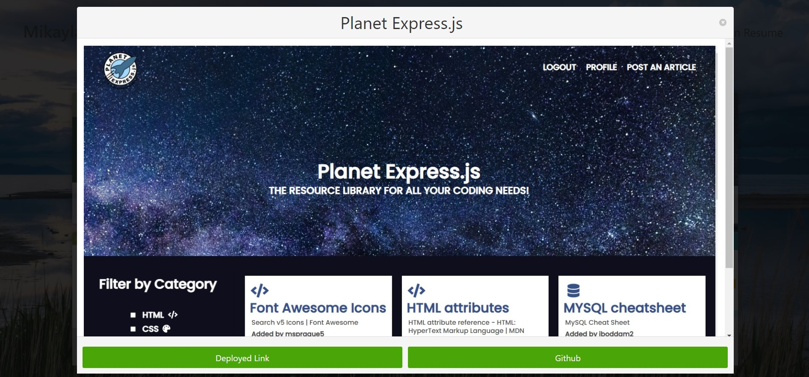
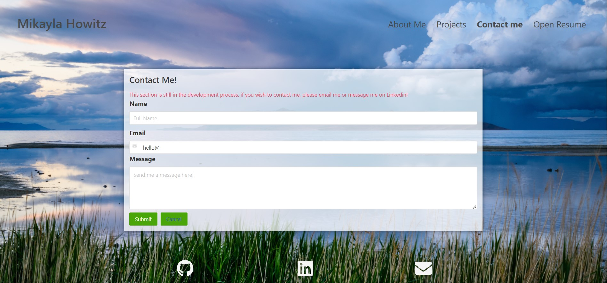

# m-howitz-portfolio

Link to deployed site: [Portfolio](https://mhowitz.github.io/m-howitz-portfolio/)

## Description

This project was created to start my very first portfolio with React. It includes a profile photo, a section about myself, how to contact me, projects I have worked on, my skills, and my resume. It was created using React and Bulma. 

## Table of Contents

* [Installation](#installation)
* [Usage](#usage)
* [License](#license)
* [Questions](#questions)

## Installation

Click the link github URL link to view the website. To view the code, click the link to the github repository. Download the repository to your computer and unzip the file. Run 'npm install' to install the dependencies, then run npm start to view on localhost:3001

## Usage

When the application is opened in the browser, the homepage is shown. The user may click the links at the top right-hand corner of the page to navigate through different sections. The about page is shown here:

The user may click on the "Projects", cards are shown with different projects I have worked on :

If the user clicks on the projects, a modal is shown where the user can click to view the repository of the project or the deployed link:

If the user clicks on the contact section, a contact form is shown. This is still in the development process. 

The user may also click on the "Open Resume" tab and my resume will open up in a separate tab. The user may also click on the icons that are always displayed at the bottom of the page to view my GitHub profile, my Linkedin, or email me. 

## License 
MIT License

Copyright (c) 2021 Mikayla Howitz

Permission is hereby granted, free of charge, to any person obtaining a copy of this software and associated documentation files (the "Software"), to deal in the Software without restriction, including without limitation the rights to use, copy, modify, merge, publish, distribute, sublicense, and/or sell copies of the Software, and to permit persons to whom the Software is furnished to do so, subject to the following conditions:

The above copyright notice and this permission notice shall be included in all copies or substantial portions of the Software.

THE SOFTWARE IS PROVIDED "AS IS", WITHOUT WARRANTY OF ANY KIND, EXPRESS OR IMPLIED, INCLUDING BUT NOT LIMITED TO THE WARRANTIES OF MERCHANTABILITY, FITNESS FOR A PARTICULAR PURPOSE AND NONINFRINGEMENT. IN NO EVENT SHALL THE AUTHORS OR COPYRIGHT HOLDERS BE LIABLE FOR ANY CLAIM, DAMAGES OR OTHER LIABILITY, WHETHER IN AN ACTION OF CONTRACT, TORT OR OTHERWISE, ARISING FROM, OUT OF OR IN CONNECTION WITH THE SOFTWARE OR THE USE OR OTHER DEALINGS IN THE SOFTWARE.

## Questions
Github username: mhowitz

Github link : https://github.com/mhowitz/m-howitz-portfolio
